# 数据结构与算法

[toc]


- [视频来源](https://www.bilibili.com/video/BV~1~Fb411M7d9?from=search&seid=6686444567517967595)

(V,R)

 例子: 最短路径

### 图的基本概念

$$
\S1 简史
$$

欧拉的图*1836*

很多桥一遍;一笔画下来

如果奇数点是0个或2个则可以一笔画出

==充分必要==条件是啥

$$
\S2 图的基本概念
$$
定义:设V为有穷集
$$
P_{z}(v)= \left(   \right)
$$

==查询==

连通无向图

强连通有向图:强连通图必须是有向图;给定有向图G=(V,E)V中的任意两个节点u和v如果节点u和v**互相可达**即至少存在一条路径可以由结点u开始，到结点v终止，同时存在至少有一条路径可以由结点v开始，到结点u终止，那么就称该有向图G是强连通图. 

弱连通有向图:若至少有一对结点不满足单向连通，但去掉边的方向后从无向图的观点看是[连通图](https://baike.baidu.com/item/连通图)，则D称为弱连通图

如何画出图示

拓扑序列:==针对有向图==,**不惟一**

若一个由图中所有点构成的序列A满足：对于图中的每条边(x, y)，x在A中都出现在y之前，则称A是该图的一个拓扑序列。


具体画**拓扑序列**出来的方法:

1. 首先找出**入度为零**的点
2. 之后去除这个点和箭头
3. 之后重复1
4. 可能会出现不同的结果,都列出来

邻接表表示法:对于稀疏图

正向邻接表:我扎了谁

逆向邻接表:谁扎了我

邻接矩阵


<!---->
深度优先搜索

> ## 详细解释
>
> 事实上，深度优先搜索属于图算法的一种，英文缩写为DFS即Depth First Search.其过程简要来说是对每一个可能的分支路径深入到不能再深入为止，==而且每个[节点](https://baike.baidu.com/item/节点)只能访问一次.==
>
> 举例说明之：下图是一个[无向图](https://baike.baidu.com/item/无向图)，如果我们从A点发起深度优先搜索（以下的访问次序并不是唯一的，第二个点既可以是B也可以是C,D），则我们可能得到如下的一个访问过程：A->B->E（没有路了！[回溯](https://baike.baidu.com/item/回溯)到A)->C->F->H->G->D（没有路，最终[回溯](https://baike.baidu.com/item/回溯)到A,A也没有未访问的相邻[节点](https://baike.baidu.com/item/节点)，本次搜索结束）.
>
> [](https://baike.baidu.com/pic/深度优先搜索/5224976/0/90cebeec00ed4212269791e3?fr=lemma&ct=single)图
>
> 简要说明深度优先搜索的特点：每次深度优先搜索的结果必然是图的一个**连通分量**.深度优先搜索可以从多点发起.如果将每个节点在深度优先搜索过程中的"结束时间"排序（具体做法是创建一个list，然后在每个节点的相邻节点都已被访问的情况下，将该节点加入list结尾，然后逆转整个链表)，则我们可以得到所谓的"[拓扑排序](https://baike.baidu.com/item/拓扑排序)",即topological sort. [1] 


### 作业

#### 第一次作业


习题 1.如图4-40所示为一有5个顶点{V~0~,V~1~,V~2~,V~3~,V~4~ }的有向图的邻接表。根据此邻
接表:


(1)画出相应的有向图;
(2)由 V~0~ 出发，画出相应的深度优先搜索生成树和广度优先搜索生成树; (3)该图是否存在拓扑排序序列?若存在给出所有可能的拓扑排序序列。
图 4-40 习题 1 中有向图的邻接表

- [ ] 需要的知识点

  - [x] 邻接表

  - [x] 有向图

  - [x] 深度优先搜索

  - [ ] 广度优先搜索

    - [x] [广度优先搜索视频](https://www.bilibili.com/video/BV~1~iE411g7HJ?from=search&seid=14799253738202265738)
    - [ ] 想起来6种对于队列的操作
    - [x] [广度优先搜索文章](https://www.cnblogs.com/wlw-x/p/12433968.html)

  - [x] 生成树

    > 对于具有 n 个顶点的连通图 G，如果存在连通子图 G'包含 G 中所有顶点和一部分边，且不形成回路，则称 G'为图 G 的生成树。显然，连通图 G 的生成树就是它的极小 连通子图，具有如下性质:
    > 
    >  1)包含 n 个顶点; 2)包含 n-1 条边;
  
  - [ ] 画出深度优先生成树和广度优先生成树
  
- [ ] [画法](https://blog.csdn.net/liupeifeng3514/article/details/83828519)
  
  - [x] 拓扑序列
  
    - [x] [解体视频](https://www.bilibili.com/video/BV~1~Dh411d7Hp?from=search&seid=14971293006446522995)
  
- [x] 用typora画出好看的图

- [x] 手写画图


---


这一段表示

 $V_{0}$指向了$V_{2}$,$V_{3}$,$V_{4}$;

 $V_{1}$指向了$V_{4}$;

 $V_{2}$指向了$V_{3}$,$V_{1}$;

 $V_{3}$指向了$V_{4}$,$V_{1}$;

 $V_{4}$什么都没有指向;

于是之后还原一下邻接矩阵
$\quad\quad\quad\quad\quad\quad\quad\quad\quad\quad\quad\quad\quad\quad\quad\quad\quad\quad\quad\quad\begin{matrix}\quad &V_0 &V_1 &V_2&V_3&V_4&\\\end{matrix}$
$$
\begin{matrix}
 V_0& \\
 V_1& \\
 V_2& \\
 V_3& \\
 V_4& \\
\end{matrix}

\begin{bmatrix}
0&0&1&1&1\\
0&0&0&0&1\\
0&1&0&1&0\\
0&1&0&0&1\\
0&0&0&0&0\\
\end{bmatrix}
$$


(1)之后画出有向图


$0\stackrel{a}{\longrightarrow}1$

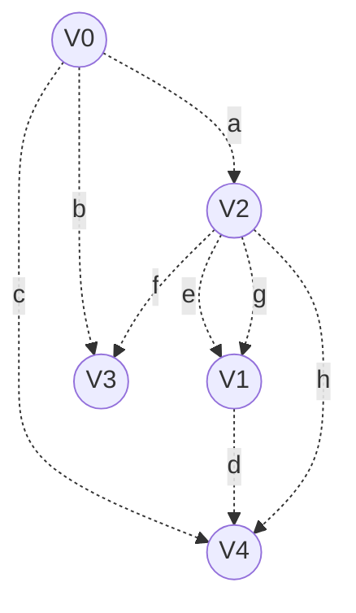


深度遍历优先树(不唯一)
$$
V_0\stackrel{a}{\longrightarrow}V_2\stackrel{e}{\longrightarrow}V_1\stackrel{d}{\longrightarrow}V_4;

V_0\stackrel{b}{\longrightarrow}V_3;
$$

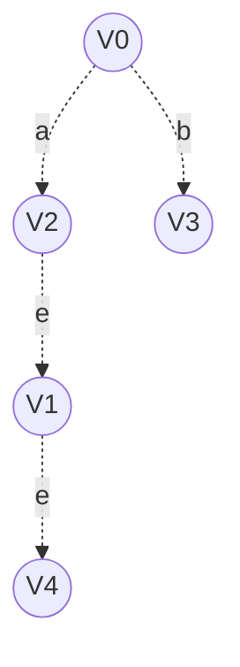


广度遍历优先树(不唯一)

$$
V_0\stackrel{c}{\longrightarrow}V_4;

V_0\stackrel{b}{\longrightarrow}V_3;

V_0\stackrel{a}{\longrightarrow}V_2;

V_2\stackrel{e}{\longrightarrow}V_1;
$$


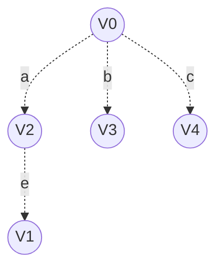


一共四种

$V_0V_2V_1V_3V_4$

$V_0V_2V_1V_4V_3$

$V_0V_2V_3V_1V_4$

$V_0V_3V_2V_1V_4$


---

- [ ] 什么时候是$\infty$
- [ ] 

### 参考书

- [ ] 165页的题

- [ ] 强连通图

- [ ] 前驱

- [ ] 后驱

- [ ] 强连通分量
- [ ] 简单路径
- [ ] 有向环
- [ ] 连通子图


### 最小生成树

[最小生成树-mooc](http://www.icourse163.org/spoc/learn/DUT-1460924164?tid=1461656447#/learn/content?type=detail&id=1238725012&sm=1)

- 概念
  - 联通图的最小生成树
  - 应用举例
- 最小生成树的构造算法
  - Prim算法
  - Kruskal算法

有N个顶点，N-1条边的


[灵魂画手讲解的两种算法](https://www.bilibili.com/video/BV~1~ns411i7Kn?from=search&seid=5863467740216924481)


#### prim算法

> 就图上的一个点选取之后,把这个点添加进集合T;
>
> 寻找和集合相连的**权最小的边**;
>
> 把这个边另一端的点也添加进集合;

​	重复上述操作

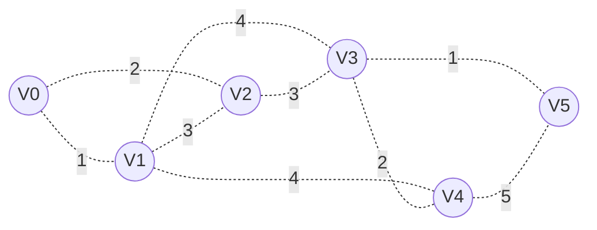

比如这里是很多的城市,我们需要修建高数公路让城市们互相连接,最好的办法就是用prim算法画出最小生成树

首先我们找到$V_0$

之后发现1<2,于是连接$V_0$和$V_1$(实线表示连接了)


```mermaid
graph LR;
A((V0));
B((V1));
C((V2));
D((V3));
E((V4));
F((V5));

A--1.-B;
A-.2.-C;
B-.3.-C;
B-.4.-D;
B-.4.-E;
C-.3.-D;
D-.2.-E;
D-.1.-F;
E-.5.-F;
```

之后一直重复这个过程,需要*N-1*次

```mermaid
graph LR;
A((V0));
B((V1));
C((V2));
D((V3));
E((V4));
F((V5));

A--1.-B;
A--.2.-C;
B-.3.-C;
B-.4.-D;
B-.4.-E;
C-.3.-D;
D-.2.-E;
D-.1.-F;
E-.5.-F;
```

```mermaid
graph LR;
A((V0));
B((V1));
C((V2));
D((V3));
E((V4));
F((V5));

A--1.-B;
A--2.-C;
B-.3.-C;
B-.4.-D;
B-.4.-E;
C--3.-D;
D-.2.-E;
D-.1.-F;
E-.5.-F;
```

```mermaid
graph LR;
A((V0));
B((V1));
C((V2));
D((V3));
E((V4));
F((V5));

A--1.-B;
A--2.-C;
B-.3.-C;
B-.4.-D;
B-.4.-E;
C--3.-D;
D-.2.-E;
D--1.-F;
E-.5.-F;
```

```mermaid
graph LR;
A((V0));
B((V1));
C((V2));
D((V3));
E((V4));
F((V5));

A--1.-B;
A--2.-C;
B-.3.-C;
B-.4.-D;
B-.4.-E;
C--3.-D;
D--2.-E;
D--1.-F;
E-.5.-F;
```

最后我们就得到了最最便宜的公路了

==这个过程是不惟一的且开始的顶点的选取是没有要求的==

### kruskal算法

> 首先把所有的顶点都添加进一个集合里面;
>
> 然后从小到大不断添加带有权值的边,发现产生连同回路之后就去掉;
>
> 最后有*N-1*条边的时候就好了

- [ ] 完成代码
- [ ] 之前的截图导入笔记

### 最短路径

[最短路径-mooc](http://www.icourse163.org/spoc/learn/DUT-1460924164?tid=1461656447#/learn/content?type=detail&id=1238731089&cid=1259450144&replay=true)

迪杰斯特拉算法(巫师3 的迪胖也叫这个)


==单源最短路径算法==

[小灰的文章](https://zhuanlan.zhihu.com/p/65340385)

==这个算法的本质，是不断刷新起点与其他各个顶点之间的 “距离表”。==


让我们来演示一下迪杰斯特拉的详细过程：


第1步，创建距离表。表中的Key是顶点名称，Value是**从起点A到对应顶点的已知最短距离**。但是，一开始我们并不知道A到其他顶点的最短距离是多少，Value默认是无限大：


第2步，遍历起点A，找到起点A的邻接顶点B和C。从A到B的距离是5，从A到C的距离是2。把这一信息刷新到距离表当中：


第3步，从距离表中找到从A出发距离最短的点，也就是顶点C。


第4步，**遍历顶点C**，找到顶点C的邻接顶点D和F（A已经遍历过，不需要考虑）。从C到D的距离是6，所以A到D的距离是2+6=8；从C到F的距离是8，所以从A到F的距离是2+8=10。把这一信息刷新到表中：


接下来重复第3步、第4步所做的操作：


第5步，也就是第3步的重复，从距离表中找到从A出发距离最短的点（C已经遍历过，不需要考虑），也就是顶点B。


第6步，也就是第4步的重复，遍历顶点B，找到顶点B的邻接顶点D和E（A已经遍历过，不需要考虑）。从B到D的距离是1，所以A到D的距离是5+1=6，**小于距离表中的8**；从B到E的距离是6，所以从A到E的距离是5+6=11。把这一信息刷新到表中：


（在第6步，A到D的距离从8刷新到6，可以看出距离表所发挥的作用。**距离表通过迭代刷新，用新路径长度取代旧路径长度，最终可以得到从起点到其他顶点的最短距离**）


第7步，从距离表中找到从A出发距离最短的点（B和C不用考虑），也就是顶点D。


第8步，遍历顶点D，找到顶点D的邻接顶点E和F。从D到E的距离是1，所以A到E的距离是6+1=7，**小于距离表中的11**；从D到F的距离是2，所以从A到F的距离是6+2=8，**小于距离表中的10**。把这一信息刷新到表中：


第9步，从距离表中找到从A出发距离最短的点，也就是顶点E。


第10步，遍历顶点E，找到顶点E的邻接顶点G。从E到G的距离是7，所以A到G的距离是7+7=14。把这一信息刷新到表中：


第11步，从距离表中找到从A出发距离最短的点，也就是顶点F。


第10步，遍历顶点F，找到顶点F的邻接顶点G。从F到G的距离是3，所以A到G的距离是8+3=11，**小于距离表中的14**。把这一信息刷新到表中：


就这样，除终点以外的全部顶点都已经遍历完毕，距离表中存储的是从起点A到所有顶点的最短距离。显然，从A到G的最短距离是11。（路径：A-C-D-F-G）

# 关键路径(critical path)

### AOE网(activity on edge network)

- [ ] 拓扑有序(topological order)
- [ ] 逆拓扑有序(topological order)
- [ ] vl(v~3~)=6是为啥呢
- [ ] 


[视频,讲的还可以](https://www.bilibili.com/video/BV~1~PW41187vc/?spm_id_from=333.788.videocard.0)(下面的笔记是按照这个视频做的)

**事件**理解为所谓的领导检查什么的,或者说其实是日程节点;事件本身只是一种状态,表示前面的活动已经结束,后面的活动可以开始

**活动**理解为每个单独的事件的前置准备需要的时间或者钱

源点:开始的点,没有入度(indegree),只有出度(outdegree)

汇点:与之相反,只有入度(indegree),没有出度(outdegree)

- 事件的最早发生时间ve[k],==是从前往后的==

$$
ve[k]=
\begin{cases}
0& \text{k=1}\\
max(ve[j]+len<v_j,v_k>),<v_j,v_k>\in p[K]& \text{k!=0}
\end{cases}
$$

$$
\mbox{p[k]表示所有到达vk的有向边的集合}
$$

- 事件的最迟发生时间vl[k],==是从后往前的==,这里的j是在k的后面的


$$
vl[k]=
\begin{cases}
ve[k]& \text{k=1}\\
min(ve[j]-len<v_j,v_k>),<v_j,v_k>\in p[K]& \text{k!=0}
\end{cases}
$$

- 活动的最早发生时间e[i]

  就是活动前置事件的最早开始时间

- 活动的最迟发生时间l[i]

  就是**事件的最迟开始时间减去活动的必要时间**

- 活动的时间余量l[k]-e[k]

  ==关键活动:上面的值是0的活动==你可以理解为这个活动只能在这个时间做!


之后我们找到关键活动,点亮关键活动的箭头之后就能得到一条或者几条线,这些线路中


### 4.6关键路径


最长路径的长度

- [x] 关键路径

  > 时间余量等于零的活动连起来之后得到的就是关键路径(critical path),关键路径(critical path)不是唯一的

- [ ] 如何通过这个AOE网(activity on edge network)知道完成整项工程至少需要多少时间呢


- [x] 疑问1:为什么v~3~的最迟发生时间是6

  > 事件的**最迟发生时间**是后面一个事件的最迟发生时间减去前面活动的时间,之后选取其中最小的一个,可以在这里把**事件本身看作对于上一个事件的DDL**,事件减去活动之后就是把时间往前*倒带*,最小的一个是因为需要顾全所有的事件才可以的.

事件的最早最迟发生时间

|          | v~1~   | v~2~ | v~3~ | v~4~   | v~5~ | v~6~ | v~7~      |      |
| -------- | ------ | ---- | ---- | ------ | ---- | ---- | --------- | ---- |
| ve(v~i~) | 0      | 6    | 3    | 7(7>4) | 16   | 13   | 18(18>16) |      |
| Vl(v~i~) | 0(0<3) | 6    | 6    | 7(7<9) | 16   | 15   | **18**    |      |


活动的最早最迟发生时间

|         | a~1~ |   a~2~   |  a~3~    |   a~4~   |  a~5~    |  a~6~    |   a~7~   |  a~8~    |
| ------- | ---- | ---- | ---- | ---- | ---- | ---- | ---- | ---- |
| e(a~i~) | 0 | 0 | 6 | 3 | 7 | 7 | 16 | 13 |
| la~i~   | 0 | 3 | 6 | 6 | 7 | 9 | 16 | 15 |


找出关键事件

|          | ==v~1~== | ==v~2~== | v~3~ | ==v~4~== | ==v~5~== | v~6~ | ==v~7~==  |
| -------- | -------- | -------- | ---- | -------- | -------- | ---- | --------- |
| ve(v~i~) | 0        | 6        | 3    | 7(7>4)   | 16       | 13   | 18(18>16) |
| Vl(v~i~) | 0(0<3)   | 6        | 6    | 7(7<9)   | 16       | 15   | **18**    |

找出关键活动

|         | ==a~1~== |   a~2~   | ==a~3~== |   a~4~   | ==a~5~== |  a~6~    |   ==a~7~==   |  a~8~    |
| ------- | ---- | ---- | ---- | ---- | ---- | ---- | ---- | ---- |
| e(a~i~) | 0 | 0 | 6 | 3 | 7 | 7 | 16 | 13 |
| la~i~   | 0 | 3 | 6 | 6 | 7 | 9 | 16 | 15 |


### 3.2顺序查找

> 静态查找
>
> 动态查找
>
> 散列

#### 概念

查找(searching)

在一组记录中找到关键码值等于给定值的某个记录,或者找到关键码值符合特定条件的某些纪录的过程,也称为**检索**

#### 预处理

**对于大数据量通过对于数据进行特殊的处理提高效率**

- 预排序

  - 算法本身比较费时
  - 在检索之前久能完成

- 建立索引

  - 牺牲一定的空间

  

- 散列技术

  - 把数据组织到一个表中根据关键码的值确定表中记录的位置
  - 缺点
    - 一般不允许出现重复的关键码
    - 不适合进行范围查询


平均检索长度(ASL)

- 关键码的比较检索运算的主要操作
- 平均检索长度
  - 检索过程中对关键码的平均比较次数
  - 衡量检算法优劣的时间标准

$$
ASL=\sum_{i=1}^{n}P_{i}C{i}
$$


$$
\mbox{ASL是存储结构中对象总数n的函数}
$$
$$
\mbox{Pi为检索第i个元素的概率}
$$
$$
\mbox{Ci为找到第i个元素所需的关键码值与给定值的比较次数}
$$
- 评价指标

  - 算法所需的存储量

  - 算法复杂度

#### 顺序查找

- 针对线性表(linear list)中的所有记录,逐个进行关键码和给定值的比较.
  - 若某个记录的关键码和给定值比较相等,则检索成功
  - 否则检索失败
- 存储方式:循序和链式
- 排序要求:无


==无需预排序==

==时间复杂度是O(n)==

#### 折半查找

#### 分块查找


内部查找

外部查找


- 静态查找
   - 顺序
      - 性能分析
        	- 查找成功
        	- 查找失败
        	- 整体
     - 优点
     - 缺点
  	- 二分法 

外部查找

散列查找


### 3.2二分法查找(searching)

> 有时候也是折半查找(searching)
>
> 需要在有序表上进行


一个例子


high只要是小于low就是查找(searching)不成功


### 第三次作业

#### 第一题


> ∞表示一个计算机允许的、大于所有边上权值的数。---或者说就是表示其实是不连接的那种


##### 首先我们画出这个邻接矩阵(adjacency matrix)对应的有向带权图(Directed weighted graph)


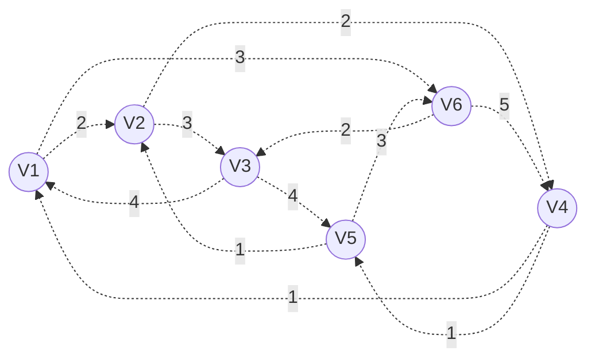

##### 接下来我们用V~1~作为起点开始下面的过程

首先找到顶点V~1~；

和V~1~最近的是V~2~

| 顶点 | 距离     |
| ---- | -------- |
| V~2~   | 2        |
| V~3~   | $\infty$ |
| V~4~   | $\infty$ |
| V~5~   | $\infty$ |
| V~6~   | $\infty$ |


之后让我们链接V~1~和V~2~，从V~2~开始找

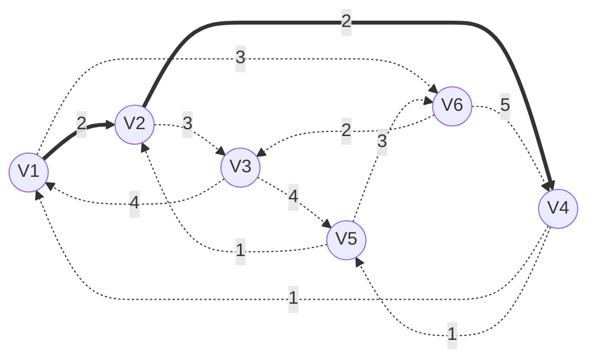
这里我们发现了V~2~链接了V~4~，这里V~2~$\to$V~4~小一点


| 顶点 | 距离     |
| ---- | -------- |
| V~2~   | 2 |
| V~3~   | $\infty$ |
| V~4~   | 2+2=4 |
| V~5~   | $\infty$ |
| V~6~   | $\infty$ |


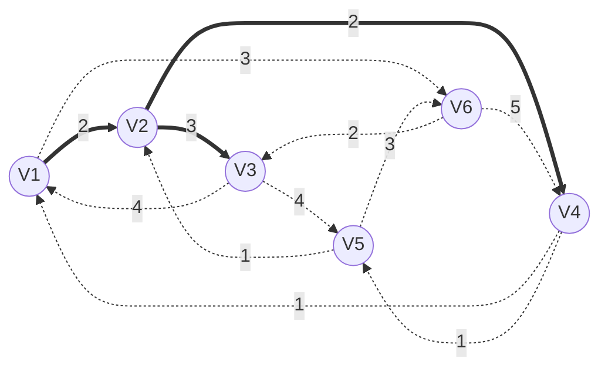

于是之后V~2~到3是3，2+3=5，顺便V~3~到V~5~，2+3+4=9


| 顶点 | 距离     |
| ---- | -------- |
| V~2~   | 2        |
| V~3~   | 2+3=5 |
| V~4~   | 4 |
| V~5~   | 2+3+4=9 |
| V~6~   | $\infty$ |


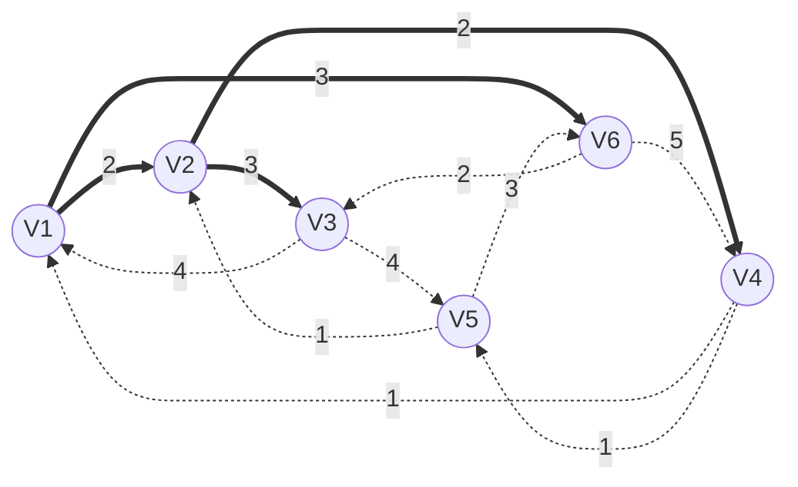


之后回到开始，遍历和V~1~链接的点，V~1~和V~6~链接上了

于是开心的刷新一下


| 顶点 | 距离     |
| ---- | -------- |
| V~2~   | 2        |
| V~3~   | 5 |
| V~4~   | 4 |
| V~5~   | 2+3+4=9 |
| V~6~  | 3 |


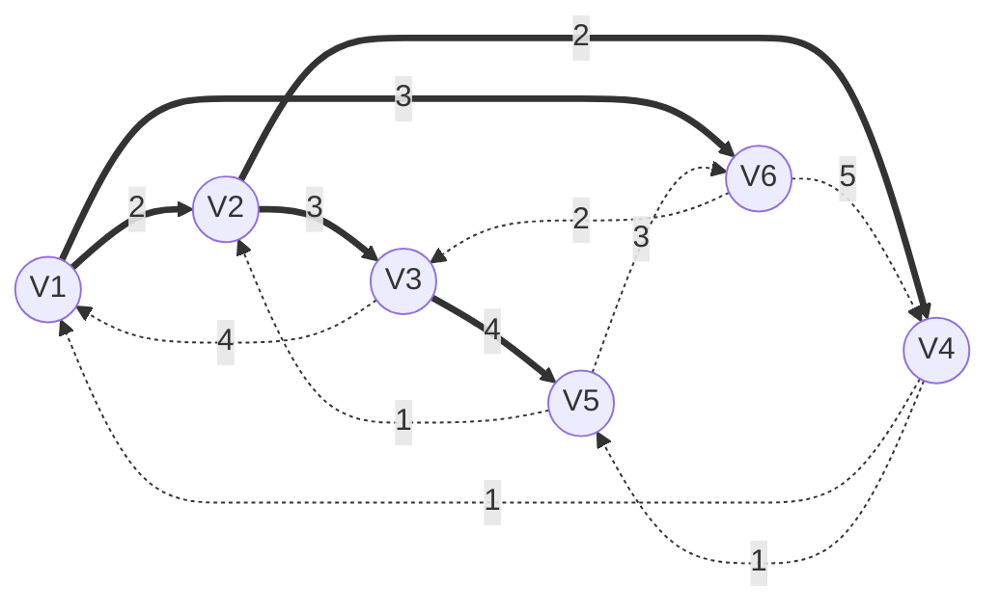


但是之后就不高兴了，V~6~链接的V~5~（3+2=5）和V~4~（3+5=8）都没办法刷新上去，所以最后还是V~2~入手的V~2~$\to$V~3~$\to$V~5~是最短的


| 顶点 | 距离     |
| ---- | -------- |
| V~2~   | 2        |
| V~3~   | 3 |
| V~4~   | 4 |
| V~5~   | 2+3+4=9 |
| V~6~   | 3 |


##### V~1~最终结果

于是得到最终的效果了


| 顶点 | 距离    |
| ---- | ------- |
| V~2~   | 2       |
| V~3~   | 3       |
| V~4~   | 4       |
| V~5~   | 2+3+4=9 |
| V~6~   | 3       |

##### 接下来我们用V~2~作为起点开始重复上面的过程


| 顶点 | 距离     |
| ---- | -------- |
| V~1~   | $\infty$ |
| V~3~   | $\infty$ |
| V~4~   | 2 |
| V~5~   | $\infty$ |
| V~6~   | $\infty$ |

V~2~开始的时候找到了V~3~和V~4~，链接V~2~和V~4~之后


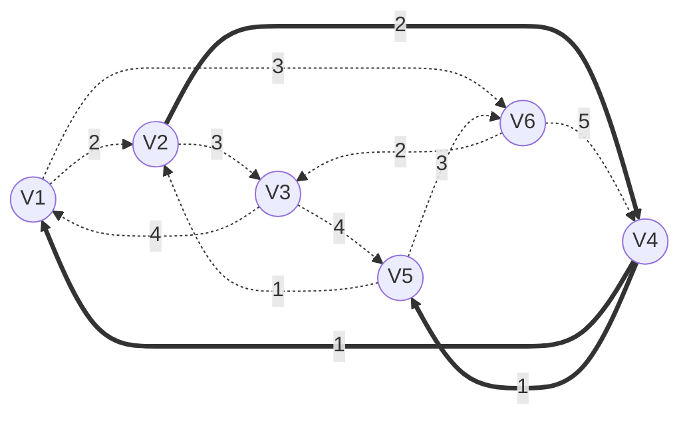


| 顶点 | 距离     |
| ---- | -------- |
| V~1~   |2+1=3 |
| V~3~   | $\infty$ |
| V~4~   | 2 |
| V~5~   | 2+1=3 |
| V~6~   | $\infty$ |


啊！捡到宝了！V~4~之后链接的3个都是可以上的


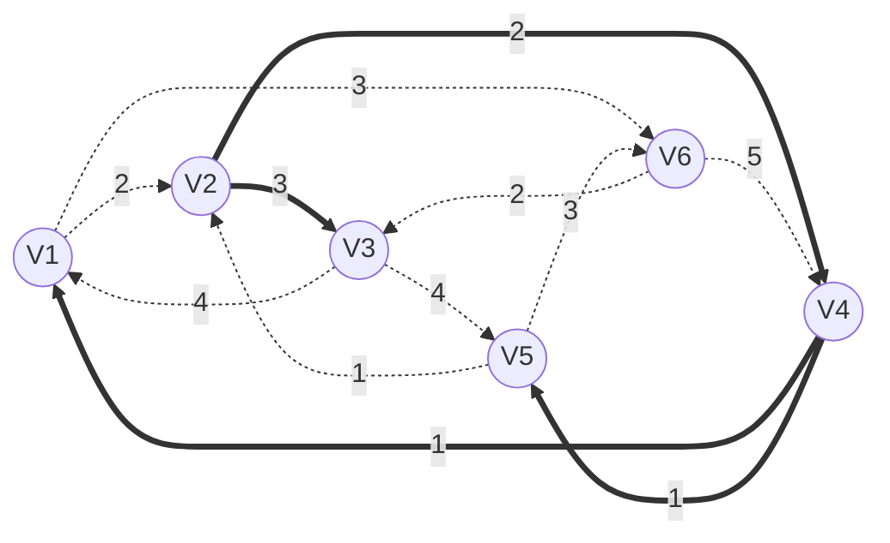


| 顶点 | 距离     |
| ---- | -------- |
| V~1~   |2+1=3 |
| V~3~   | 3 |
| V~4~   | 2 |
| V~5~   | 2+1=3 |
| V~6~   | $\infty$ |

之后回去V~2~和V~3~连上


之后就没有收获了，于是保持原样不动


| 顶点 | 距离     |
| ---- | -------- |
| V~1~   |2+1=3 |
| V~3~   | 3 |
| V~4~   | 2 |
| V~5~   | 2+1=3 |
| V~6~   | $\infty$ |


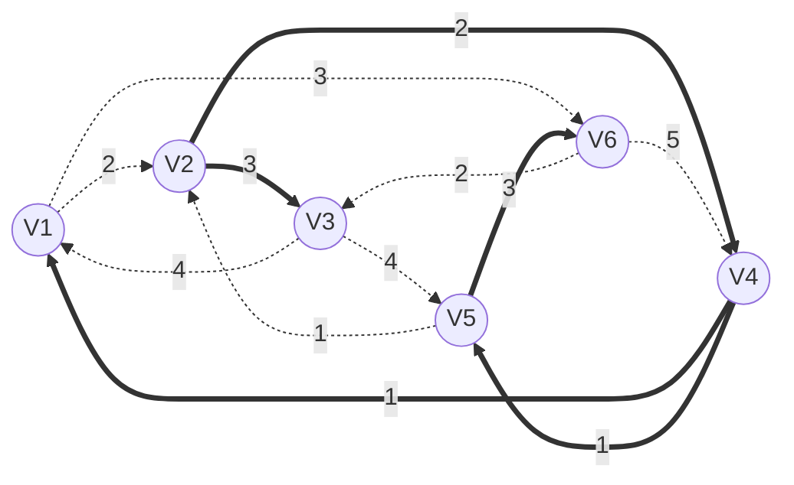


##### V~2~最终结果

| 顶点 | 距离     |
| ---- | -------- |
| V~1~   |2+1=3 |
| V~3~   | 3 |
| V~4~   | 2 |
| V~5~   | 2+1=3 |
| V~6~   | 2+1+3=6 |


广度优先遍历之后开始下一层！V~1~或者V~5~开始之后你发现这两个到V~6~的距离是一样的！

##### 接下来我们用V~3~作为起点开始重复上面的过程


```mermaid
graph LR;
A((V1));
B((V2));
C((V3));
D((V4));
E((V5));
F((V6));

A-.2.->B;

A-.3.->F;

B-.3.->C;

B-.2.->D;

C==4==>A;

C==4==>E;

D-.1.->A;

D-.1.->E;

E-.1.->B;

E-.3.->F;

F-.2.->C;

F-.5.->D;


```

| 顶点 | 距离     |
| ---- | -------- |
| V~1~   | 4 |
| V~2~   | ~~6~~之后是5 |
| V~4~   | 7 |
| V~5~   | 4 |
| V~6~   | 7 |

开始的时候就只找到了V~1~和V~5~


```mermaid
graph LR;
A((V1));
B((V2));
C((V3));
D((V4));
E((V5));
F((V6));

A-.2.->B;

A-.3.->F;

B-.3.->C;

B-.2.->D;

C==4==>A;

C==4==>E;

D-.1.->A;

D-.1.->E;

E==1==>B;

E-.3.->F;

F-.2.->C;

F-.5.->D;


```
##### V~3~最终结果
| 顶点 | 距离     |
| ---- | -------- |
| V~1~   | 4 |
| V~2~   | 4+1=5 |
| V~4~   | $\infty$ |
| V~5~   | 4 |
| V~6~   | $\infty$ |

于是找到了V~3~到V~2~的最短路径(shortest path)了

##### 接下来我们用V~4~作为起点开始重复上面的过程

```mermaid
graph LR;
A((V1));
B((V2));
C((V3));
D((V4));
E((V5));
F((V6));

A-.2.->B;

A-.3.->F;

B-.3.->C;

B-.2.->D;

C-.4.->A;

C-.4.->E;

D-.1.->A;

D-.1.->E;

E-.1.->B;

E-.3.->F;

F-.2.->C;

F-.5.->D;


```

| 顶点 | 距离     |
| ---- | -------- |
| V~1~  | $\infty$ |
| V~2~   | $\infty$ |
| V~3~   | $\infty$ |
| V~5~   | $\infty$ |
| V~6~   | $\infty$ |

开始的时候V~1~和V~5~都是1

```mermaid
graph LR;
A((V1));
B((V2));
C((V3));
D((V4));
E((V5));
F((V6));

A-.2.->B;

A-.3.->F;

B-.3.->C;

B-.2.->D;

C-.4.->A;

C-.4.->E;

D-.1.->A;

D==1==>E;

E-.1.->B;

E-.3.->F;

F-.2.->C;

F-.5.->D;


```

| 顶点 | 距离     |
| ---- | -------- |
| V~1~   | 1 |
| V~2~   | $\infty$ |
| V~3~   | $\infty$ |
| V~5~   | 1 |
| V~6~   | $\infty$ |


```mermaid
graph LR;
A((V1));
B((V2));
C((V3));
D((V4));
E((V5));
F((V6));

A-.2.->B;

A-.3.->F;

B-.3.->C;

B-.2.->D;

C-.4.->A;

C-.4.->E;

D-.1.->A;

D==1==>E;

E==1==>B;

E==3==>F;

F-.2.->C;

F-.5.->D;


```

| 顶点 | 距离     |
| ---- | -------- |
| V~1~   | 1 |
| V~2~   | 1+1=2 |
| V~3~   | $\infty$ |
| V~5~   | 1 |
| V~6~   | 1+3=4 |

之后切换 V~1~$\to$V~4~ 发现没有可以刷新的，于是广度优先的这一层没事了，V~1~$\to$V~5~开始

之后就是V~5~$\to$V~2~ +3得到V~3~ 1+1+3=5


```mermaid
graph LR;
A((V1));
B((V2));
C((V3));
D((V4));
E((V5));
F((V6));

A-.2.->B;

A-.3.->F;

B==3==>C;

B-.2.->D;

C-.4.->A;

C-.4.->E;

D-.1.->A;

D==1==>E;

E==1==>B;

E==3==>F;

F-.2.->C;

F-.5.->D;


```

| 顶点 | 距离     |
| ---- | -------- |
| V~1~   | 1 |
| V~2~   | 1+1=2 |
| V~3~   | 1+1+3=5 |
| V~5~   | 1 |
| V~6~   | 1+3=4 |


之后是另外一条支线：V~4~$\to$V~5~$\to$V~6~


到V~3~也是6，不能刷新

于是最后的结果就是这个


##### V~4~最终结果


| 顶点 | 距离     |
| ---- | -------- |
| V~1~   | 1 |
| V~2~   | 2 |
| V~3~   | 5 |
| V~5~   | 1 |
| V~6~   | 4 |


##### 接下来我们用V~5~作为起点开始重复上面的过程


```mermaid
graph LR;
A((V1));
B((V2));
C((V3));
D((V4));
E((V5));
F((V6));

A-.2.->B;

A-.3.->F;

B-.3.->C;

B-.2.->D;

C-.4.->A;

C-.4.->E;

D-.1.->A;

D-.1.->E;

E-.1.->B;

E-.3.->F;

F-.2.->C;

F-.5.->D;


```

| 顶点 | 距离     |
| ---- | -------- |
| V~1~   | $\infty$ |
| V~2~   | $\infty$ |
| V~3~   | $\infty$ |
| V~4~   | $\infty$ |
| V~6~   | $\infty$ |


开始的时候发现V~5~后面是V~2~于是

```mermaid
graph LR;
A((V1));
B((V2));
C((V3));
D((V4));
E((V5));
F((V6));

A-.2.->B;

A-.3.->F;

B==3==>C;

B==2==>D;

C-.4.->A;

C-.4.->E;

D-.1.->A;

D-.1.->E;

E==1==>B;

E-.3.->F;

F-.2.->C;

F-.5.->D;


```

| 顶点 | 距离     |
| ---- | -------- |
| V~1~   | $\infty$ |
| V~2~   | 1 |
| V~3~   | 1+3=4 |
| V~4~   | 1+2=3 |
| V~6~   | $\infty$ |


之后就是V~5~$\to$V~2~$\to$后面的


```mermaid
graph LR;
A((V1));
B((V2));
C((V3));
D((V4));
E((V5));
F((V6));

A-.2.->B;

A-.3.->F;

B==3==>C;

B==2==>D;

C-.4.->A;

C-.4.->E;

D-.1.->A;

D-.1.->E;

E==1==>B;

E==3==>F;

F-.2.->C;

F-.5.->D;


```

| 顶点 | 距离     |
| ---- | -------- |
| V~1~   | $\infty$ |
| V~2~   | 1 |
| V~3~   | 1+3=4|
| V~4~   | 1+2=3 |
| V~6~   | 3 |


上面的遍历之后广度优先的就回来看V~5~$\to$V~6~


但是之后没有刷新

```mermaid
graph LR;
A((V1));
B((V2));
C((V3));
D((V4));
E((V5));
F((V6));

A-.2.->B;

A-.3.->F;

B==3==>C;

B==2==>D;

C-.4.->A;

C-.4.->E;

D-.1.->A;

D-.1.->E;

E==1==>B;

E==3==>F;

F-.2.->C;

F-.5.->D;


```

| 顶点 | 距离     |
| ---- | -------- |
| V~1~   | $\infty$ |
| V~2~   | 1 |
| V~3~   | 1+3=4|
| V~4~   | 1+2=3 |
| V~6~   | 3 |


下一层就是 V~5~$\to$V~2~$\to$V~3~或者$\to$V~4~$\to$之后的V~1~

 V~5~$\to$V~2~$\to$V~3~$\to$之后的V~1~=8
 V~5~$\to$V~2~$\to$V~4~$\to$之后的V~1~=4


于是之后的就是


 ```mermaid
graph LR;
A((V1));
B((V2));
C((V3));
D((V4));
E((V5));
F((V6));

A-.2.->B;

A-.3.->F;

B==3==>C;

B==2==>D;

C-.4.->A;

C-.4.->E;

D==1==>A;

D-.1.->E;

E==1==>B;

E==3==>F;

F-.2.->C;

F-.5.->D;


 ```

##### V~5~最终结果

| 顶点 | 距离     |
| ---- | -------- |
| V~1~   | 1+2+1=4 |
| V~2~   | 1 |
| V~3~   | 1+3=4|
| V~4~   | 1+2=3 |
| V~6~   | 3 |


##### 接下来我们用V~6~作为起点开始重复上面的过程


```mermaid
graph LR;
A((V1));
B((V2));
C((V3));
D((V4));
E((V5));
F((V6));

A-.2.->B;

A-.3.->F;

B-.3.->C;

B-.2.->D;

C-.4.->A;

C-.4.->E;

D-.1.->A;

D-.1.->E;

E-.1.->B;

E-.3.->F;

F-.2.->C;

F-.5.->D;


```

| 顶点 | 距离     |
| ---- | -------- |
| V~1~   | $\infty$ |
| V~2~   | $\infty$ |
| V~3~   | $\infty$ |
| V~4~   | $\infty$ |
| V~5~   | $\infty$ |


看见V~6~,应该是V~3~能扎


```mermaid
graph LR;
A((V1));
B((V2));
C((V3));
D((V4));
E((V5));
F((V6));

A-.2.->B;

A-.3.->F;

B-.3.->C;

B-.2.->D;

C-.4.->A;

C-.4.->E;

D-.1.->A;

D-.1.->E;

E-.1.->B;

E-.3.->F;

F==2==>C;

F-.5.->D;


```

| 顶点 | 距离     |
| ---- | -------- |
| V~1~   | $\infty$ |
| V~2~   | $\infty$ |
| V~3~   | 2 |
| V~4~   | $\infty$ |
| V~5~   | $\infty$ |


之后V~3~出发了!


```mermaid
graph LR;
A((V1));
B((V2));
C((V3));
D((V4));
E((V5));
F((V6));

A-.2.->B;

A-.3.->F;

B-.3.->C;

B-.2.->D;

C==4==>A;

C==4==>E;

D-.1.->A;

D-.1.->E;

E==1==>B;

E-.3.->F;

F==2==>C;

F-.5.->D;


```

| 顶点 | 距离     |
| ---- | -------- |
| V~1~   | 4 |
| V~2~   | 7 |
| V~3~   | 2 |
| V~4~   | $\infty$ |
| V~5~   | 6 |


之后回到V~4~


##### V~6~最终结果


```mermaid
graph LR;
A((V1));
B((V2));
C((V3));
D((V4));
E((V5));
F((V6));

A-.2.->B;

A-.3.->F;

B-.3.->C;

B-.2.->D;

C==4==>A;

C==4==>E;

D-.1.->A;

D-.1.->E;

E==1==>B;

E-.3.->F;

F==2==>C;

F==5==>D;


```

| 顶点 | 距离     |
| ---- | -------- |
| V~1~   | 4 |
| V~2~   | 7 |
| V~3~   | 2 |
| V~4~   | 5 |
| V~5~   | 6 |


于是上面的就完结了,整理6个表格之后得到一个6*6的表格,再根据对角线加和

| \null | V~1~  | V~2~  | V~3~  | V~4~  | V~5~  | V~6~  |
| ----- | ----- | ----- | ----- | ----- | ----- | ----- |
| V~1~  | \null | 2     | 3     | 4     | 9     | 3     |
| V~2~  | 3     | \null | 3     | 2     | 3     | 6     |
| V~3~  | 4     | 5     | \null | 7     | 4     | 7     |
| V~4~  | 1     | 2     | 5     | \null | 1     | 4     |
| V~5~  | 4     | 1     | 4     | 3     | \null | 3     |
| V~6~  | 4     | 7     | 2     | 5     | 6     | \null |

对角线加和

V~1~:37

V~2~:34

V~3~:44

V~4~:34

V~5~:36

V~6~:47


##### 这道题的最终结果是

最后可以在V~2~或者V~4~的地方娱乐建立场


#### 第二题


先看下:一共有10个事件


- 事件的最早/最晚发生时间


|          | a    | b    | ==c== | d    | ==f== | e    | ==h== | ==g== | ==i== | ==w==(不是j!错了一次!) |
| -------- | ---- | ---- | ----- | ---- | ----- | ---- | ----- | ----- | ----- | ---------------------- |
| ve(v~i~) | 1    | 6    | 3     | 4    | 13    | 24   | 22    | 39    | 0     | 52                     |
| vl(v~i~) | 29   | 24   | 3     | 7    | 13    | 31   | 22    | 39    | 0     | 52                     |

- 活动的最早.最晚开始时间


|         | i~1~ | i~2~ | ==i~3~== | i~4~ | a~1~ | b~1~    | b~2~     | c~1~    | ==c~2~== | D~1~   | E~1~   | F~1~     | f~2~     | ==F~3~== | ==g~1~== | ==H~1~== | H2       |
| ------- | ---- | ---- | -------- | ---- | ---- | ------- | -------- | ------- | -------- | ------ | ------ | -------- | -------- | -------- | -------- | -------- | -------- |
| e(v~i~) | 0    | 0    | 0        | 0    | 1    | 6       | 6        | 3       | 3        | 4      | 24     | 13       | 13       | 13       | 39       | 22       | 22       |
| l(v~i~) | 28   | 18   | 0        | 3    | 29   | 31-7=24 | 52-21=31 | 39-5=34 | 13-10=3  | 13-6=7 | 13-6=7 | 31-11=20 | 52-16=36 | 22-9=13  | 52-13=39 | 39-17=22 | 52-12=40 |


#### 第三题


> 描述折半查找过程的二叉树为判定树。

##### 第一问

首先我数数

长度是12

中间记录是(1+12)/2,向下取整,是6号元素

| 编号 | 1    | 2    | 3    | 4    | 5    | **6**  | 7    | 8    | 9    | 10   | 11   | 12   |
| ---- | ---- | ---- | ---- | ---- | ---- | ------ | ---- | ---- | ---- | ---- | ---- | ---- |
| 数据 | 13   | 14   | 25   | 27   | 34   | **38** | 40   | 49   | 53   | 67   | 79   | 85   |


就是你了!**38**,**6号**!

之后考虑一下对于6号的左边

中间记录是(1+5)/2,向下取整,是3号元素

对于6号的右边

中间记录是(7+11)/2,向下取整,是9号元素


对于3号元素的左边

中间记录是(1+2)/2,,向下取整,是1号元素

对于3号的右边

中间记录是(4+5)/2,向下取整,是4号元素


对于9号元素的左边

中间记录是(7+8)/2,,向下取整,是7号元素

对于9号的右边

中间记录是(10+11)/2,向下取整,是10号元素

剩下的最后塞进去

然后中序排列

```mermaid


graph TB;
A((38));
B((25));
C((53));
D((13));
E((27));
F((40));
G((67));
H((14));
I((34));
K((49));
L((79));
M((85));
A-.5.->B;

A-.7.->C;

B-.1.->D;

B-.2.->E;

C-.8.->F;

C-.10.->G;

D-.->H;


E-.->I;


F-.->K;


G-.->L;

G-.->M;


```

==最下面的都在右边歪着,是右孩子==

之后是比较

##### 第二问

38

53

40


##### 第三问

38

53

67

85

##### 第四问

$$
ASL=\frac{n+1}{n}log_{2}(n+1)-1
$$

n=12
$$
ASL=\frac{13}{12}log_{2}13-1
$$
这么多


#### 第四次作业

##### 第一题


设有一棵空的3阶B-树，依次插入关键字30，20，10，40，80，58，47，50，29，22，56，98，99，请画出该树。

并给出依次删除29，47之后的B-树。

- [x] B-树的插入和删除

$\prod_{}^{}$

- [ ] 什么是退化为线性

除去根结点最少的时候1个关键字,最多的时候是2个关键字

```mermaid
graph TB;
id1[30 20];


```


```mermaid
graph TB;
id1[30 20 10];


```

```mermaid
graph TB;
id1[20];
id2[10];
id3[30];
id1-->id2;
id1-->id3;

```


```mermaid
graph TB;
id1[20];
id2[10];
id3[30 40];
id1-->id2;
id1-->id3;


```

```mermaid
graph TB;
id1[20];
id2[10];
id3[30 40 80];
id1-->id2;
id1-->id3;


```

```mermaid
graph TB;
id1[20 40];
id2[10];
id3[30];
id4[80];
id1-->id2;
id1-->id3;
id1-->id4;


```


```mermaid


graph TB;
id1[20 40];
id2[10];
id3[30];
id4[ 58 80];
id1-->id2;
id1-->id3;
id1-->id4;

```


##### 第二题


简要叙述B-树与B+树的区别

| B+树                                                         | B-树                                               |
| ------------------------------------------------------------ | -------------------------------------------------- |
| 具有n个关键字的结点只含有n颗子树，即每个关键字对应一颗子树   | 含有n+1颗子树                                      |
| 每个结点的关键字个数n的范围是$\lceil m/2 \rceil<=n<=m$,根节点是$1<=n<=m$ | $\lceil m/2 \rceil-1<=n<=m-1$;根节点是$1<=n<=m-1$  |
| 叶结点包含信息，所有非叶结点只起索引作用，非叶结点中的每个索引项只含有对应子树的最大关键字和指向该子树的指针，不含有该关键字对应记录的存储地址 |                                                    |
| 叶结点包含了全部关键字                                       | 叶结点包含的关键字和其他结点包含的关键字是不重复的 |


## 动态查找

### B树(Balanced Tree) 

[b站的王道考研](https://www.bilibili.com/video/BV1qE411273M/?spm_id_from=333.788.videocard.1)


描述一颗 B树时需要指定它的阶数，**阶数** 表示 此树的结点 **最多** 有 **多少个孩子结点（子树）**，一般用字母 M 表示阶数。

M 阶的B树 ：以【子树】讨论

- 上限：每个节点最多有 M 个子树
- 下限：
  根节点至少2个子树，
  非根节点至少有⌈M /2⌉个子树

所以也称 M 阶B树 为 ( ⌈M /2⌉ , M ) 树 ，即**超级节点**（除根节点）的子树数的上下限 。

**注：** 超级节点关键码的个数 = 节点子树数 - 1 。

例：

```java
M = 4 阶，（2, 4）树。 最多含有 3个关键字 和 4个子树
M = 5 阶，（3, 5）树。 最多含有 4个关键字 和 5个子树
M = 6 阶，（3, 6）树。 最多含有 5个关键字 和 6个子树

```

所以，**M阶 可理解为 M树，即内含（M-1）个关键字 和 M 个子树。**


多种查找方式的ASL[总结](https://blog.csdn.net/qq_18888869/article/details/88540334)

## 哈希
通过关键码进行映射查找的函数
冲突是一定会发生的：重点是如何解决冲突
我们不知道数据的分布